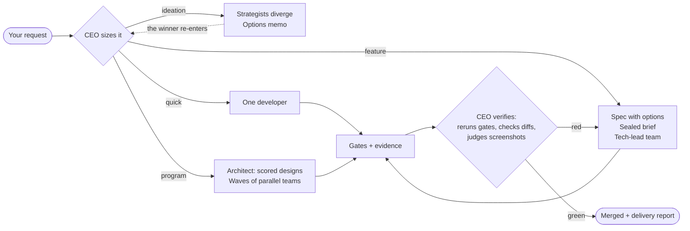
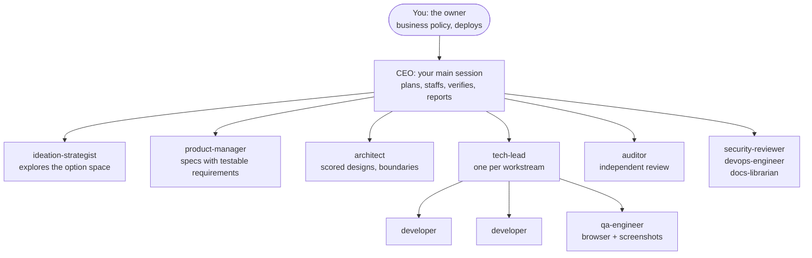

<div align="center">

# claude-company

**An AI software company you drop into your repo.**

[](LICENSE)
[](https://claude.com/claude-code)
[](#shield-the-rules-it-enforces)

<p>
  <a href="#bulb-about">About</a> &nbsp;&bull;&nbsp;
  <a href="#rocket-get-started">Get Started</a> &nbsp;&bull;&nbsp;
  <a href="#gear-how-it-works">How It Works</a> &nbsp;&bull;&nbsp;
  <a href="#busts_in_silhouette-the-team">The Team</a> &nbsp;&bull;&nbsp;
  <a href="#shield-the-rules-it-enforces">The Rules</a> &nbsp;&bull;&nbsp;
  <a href="#question-faq">FAQ</a>
</p>

</div>

## :bulb: About

You describe what you want built. A CEO agent plans the work, staffs a team of AI product managers, architects, tech leads, developers, and QA engineers, builds it, tests it in a real browser with screenshots, and reports back with proof.

```text
you>  /orchestrator build me a waitlist page with an admin view

CEO   sized the request: feature
CEO   product-manager wrote the spec (3 options considered, picked #2)
CEO   tech-lead "waitlist" spawned 2 developers + 1 QA engineer
QA    captured: loaded / empty / error / after-signup screenshots
CEO   gates: lint PASS  typecheck PASS  tests PASS (stamped)
CEO   merged. Here is what shipped, the evidence, and one decision I need from you.
```

Most multi-agent frameworks write their process as prompts and hope the model follows them. Under pressure, models skip steps: they commit failing code, edit tests until they pass, and mark their own work as done. claude-company replaces hope with enforcement:

> **Gates are enforced, not narrated.** Hooks (small scripts that run before every action) block the bad action itself: no commit while tests fail, no code without a plan, no editing protected files, no gaming the test suite. Every block is logged.

And it is frictionless where it matters: **you are the client, not the process operator**. Specs, briefs, task state, and gate config are all generated by the agents themselves. You hear back for two reasons only: decisions that belong to you, and delivery with evidence.

## :rocket: Get started

1. Clone this repo and run the installer against your project:

```bash
git clone https://github.com/you/claude-company
bash claude-company/install.sh /path/to/your/project
```

2. Open your project in Claude Code and start the company:

```text
/orchestrator build me <what you want>
```

There is no setup step. On first contact the company onboards itself: it studies your codebase (or treats your request as the founding brief of a new one), finds your real test and lint commands, and wires them in as gates. The installer merges with your existing settings and never overwrites them; running it twice changes nothing.

| Requirement | Why |
|---|---|
| Claude Code v2.1.172+ | Nested agents (tech leads run their own teams) |
| Python 3.8+, bash, git | The enforcement hooks |
| Node.js with `npx` | Browser testing with screenshots (Playwright) |

The [getting started guide](docs/getting-started.md) walks the full path from install to first delivery.

## :gear: How it works

The CEO sizes every request, so a typo fix never gets a committee and a product build never skips design:



Five things happen on every build, regardless of size:

1. **Plans come first.** For features and products, the product manager explores 8 to 15 directions before writing the spec, and the architect picks the design from 2 to 3 scored alternatives. Both record the options they rejected and why.
2. **Work orders are sealed.** Builders receive a brief: mission, exact owned directories, definition of done, and a decided fallback for every ambiguity. Ten parallel agents make the same assumption instead of ten different ones.
3. **Teams build in parallel.** Each tech lead runs its own developers on separate directories in an isolated git worktree, fills the gaps between their pieces, and sends a QA engineer through the running app.
4. **Producers never grade their own work.** Developers report, leads verify, QA captures screenshots but does not judge them, the CEO judges, and an independent auditor rechecks the big merges.
5. **The gates decide.** Your test suite, linter, and build run as a stamped ladder. The stamp goes stale the moment a file changes, and the commit hook blocks anything red, stale, or unstamped.

Read [how it works](docs/how-it-works.md) for the full method, including diagrams of the pipeline, the gate lifecycle, and the change-request flow.

## :busts_in_silhouette: The team



| Role | Judges its own output? | Writes code? | Spawns agents? |
|---|:---:|:---:|:---:|
| CEO (your session) | Verifies everyone else | Glue and small fixes | Yes |
| tech-lead | Verifies its developers | Gap-filling between pieces | Yes: its own team |
| developer | No: reports with evidence | Yes | No |
| qa-engineer | No: captures, never judges | No | No |
| auditor | Independent by design | No: read-only | No |

## :shield: The rules it enforces

Each rule is a hook that blocks the action itself. When a hook blocks an agent, the message contains the recipe to become compliant, so the process self-heals instead of stalling.

| Rule | What gets blocked |
|---|---|
| Protected files stay protected | Edits to `.env`, lockfiles, shipped migrations, and any file your project marks as frozen |
| No commit while tests fail | `git commit` when the gate suite is red, stale, or was never run |
| No code without a plan | Source-code changes when no approved work order exists |
| Tests are the referee | Editing or deleting tests that the current work order does not cover |
| No AI filler in writing | Em dashes, smart quotes, and stock AI phrases in anything written |
| No quitting early | Ending a work session while the active task's gates are red |

Every block and every hotfix bypass is one line in `company/state/adherence.log`, so enforcement is visible, not claimed. All hooks fail open: an internal error lets the action through rather than jamming your session.

## :keyboard: Commands

| Command | What it does |
|---|---|
| `/orchestrator` | Start or resume the company. The only command you need day to day |
| `/brainstorm` | Explore ideas in parallel and get an options memo with a recommendation |
| `/standup` | One-screen status: done, in flight, blocked, decisions you owe |
| `/feature` | Run one feature through the full pipeline |
| `/gates` | Run the test gates and stamp the result |
| `/company-init`, `/onboard` | Found the company explicitly (new project or existing codebase) |
| `/cr` | File or decide a change request against a protected file |

## :wrench: Customizing

Everything is a plain file you can read and edit: gates in `company/gates.config`, protected files in `company/frozen-surfaces.json`, roles in `.claude/agents/`, process in `company/METHOD.md`. The [customizing guide](docs/customizing.md) covers the common changes.

## :question: FAQ

<details>
<summary><b>How much does it cost to run?</b></summary>
<br>

More than a single Claude session: parallel agents multiply token use. The company counters this by scaling ceremony to the task, so small fixes get one developer and no meetings.

</details>

<details>
<summary><b>Does it work on an existing codebase?</b></summary>
<br>

Yes. It reads your code, adopts your conventions, and wires your existing test commands in as gates. It adapts to your project, not the other way around.

</details>

<details>
<summary><b>What if a gate is wrong or blocks me unfairly?</b></summary>
<br>

Gates are your own commands in `company/gates.config`; edit them anytime. For real emergencies there is a hotfix mode that logs instead of blocks, and the process catches up afterward.

</details>

<details>
<summary><b>Can I see what it decided and why?</b></summary>
<br>

Yes. Specs record the options considered, memos record the roads not taken, decisions wait for you in `company/state/DECISIONS.md`, and the adherence log records every block.

</details>

<details>
<summary><b>What does the owner keep?</b></summary>
<br>

No agent, including the CEO, ever decides: production deploys, database migrations in production, anything involving money, weakening a protection rule, or business policy. The company merges to your main branch; shipping to users is a button only you press.

</details>

## :books: Documentation

| Document | What it covers |
|---|---|
| [Getting started](docs/getting-started.md) | Install to first delivery, step by step |
| [How it works](docs/how-it-works.md) | The method: pipeline, gates, protected files, verification |
| [Customizing](docs/customizing.md) | Gates, frozen files, roles, and process depth |
| `company/METHOD.md` | The canon the agents themselves follow |
| `company/GIT.md` | Worktrees, branches, commit rules, merge and cleanup |
| `ORCHESTRATOR.md` | The CEO's private runbook |

## :page_facing_up: License

This project is licensed under the MIT License. See the [LICENSE](LICENSE) file for details.
