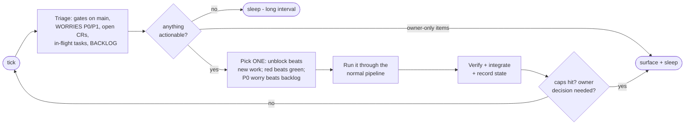

# LOOPS.md - Standing operation (loop engineering) [EXPERIMENTAL]

**Experimental and strictly opt-in.** Nothing in this page runs unless the
owner explicitly invokes `/autopilot` or schedules it themselves. No agent,
including the CEO, starts a loop on its own initiative. The intended moment
is the end phase of a product: the main build shipped interactively, and the
loop burns down the backlog, polish items, and worry ledger in bounded,
reviewable ticks.

Prompting the company task by task is mode one. Mode two is the loop: the
company runs on a heartbeat, discovers its own work, executes it through the
normal pipeline, and surfaces only what needs the owner. This page is the
doctrine for running unattended without becoming a runaway process.

The premise (loop engineering, 2026): the human stops being the person who
prompts the agent and becomes the person who designs the system that
prompts, checks, and reruns the agent. claude-company already carries the
load-bearing parts of that system - worktrees, maker/checker separation,
persistent state, skills, hooks. The loop adds the heartbeat and the
discipline around it.

## The iron rules (before any loop runs)

1. **No loop without a mechanical verifier.** Every iteration ends at the
   gates and the evidence protocol, same as interactive work. A loop that
   trusts its own narration is a mistake generator with a scheduler.
2. **No loop without a cap.** Every loop declares, before it starts: max
   engagements per run, max attempts per failure, and when it must stop and
   surface. A loop with no ceiling spends until the tokens run out.
3. **The owner's attention is the scarce resource.** The loop optimizes for
   review throughput: small integrated deliveries with evidence bundles,
   never a week of unreviewed output. Unread loop output is comprehension
   debt - the company ships code nobody understands.
4. **Loops accelerate understood work; they never replace thinking.** Fuzzy
   or novel asks still route through ideation and specs. The loop is for
   the backlog, the red gates, and the worry ledger - not for inventing
   strategy unattended.

## The heartbeat (one iteration)

Each tick of the standing loop is one pass of the operating loop, bounded:

Triage order is fixed: red gates on main first, then in-flight work to
unblock or integrate, then P0/P1 worries, then open CRs, then the top of
`company/state/BACKLOG.md`. New backlog work starts only when nothing above
it needs attention.

## Stop-and-surface conditions (every loop honors all of these)

| Condition | Why the loop must not push through |
|---|---|
| An owner-escalation item (money, deploy, scope, policy) | Those decisions are never made unattended |
| The same gate red twice on the same cause | Design problem, not an agent problem |
| Per-run engagement cap reached | Review throughput is the bottleneck, not generation |
| Two consecutive ticks with nothing actionable | An idle loop burning tokens is waste; lengthen the interval or stop |
| Any hook block the loop cannot self-serve per the recipe | The enforcement layer outranks the loop |

## Running it

The `/autopilot` skill is the payload; Claude Code's native loop primitives
are the scheduler. Pick by attendance:

| Mode | How | Fits |
|---|---|---|
| Attended burst | `/autopilot` once | Clear a backlog while you watch the reports land |
| Semi-attended | `/loop /autopilot` (self-paced) | You are around; the company self-paces its ticks and you can interrupt |
| Unattended | `/schedule` a cloud routine running `/autopilot` | Overnight/weekend triage and small deliveries, capped tight |

Unattended runs get the tightest caps: fewer engagements per run, quick and
feature class only (never program, never hotfix), and every delivery waits
merged-but-unreported until the owner reads the evidence.

## State the loop lives on

The loop is stateless between ticks by design; everything it knows is in
files (the model forgets, the repo remembers):

- `company/state/BACKLOG.md` - the discovered-work queue. The owner drops
  wishes here in one line each; triage, audits, and QA findings append
  candidates. The loop pulls from the top; nothing enters the pipeline
  without becoming a classified engagement first.
- `company/state/RESUME.md` - what the last tick finished and what the next
  should do first.
- `company/state/STATUS.md`, `WORRIES.md`, `DECISIONS.md`, `adherence.log` -
  the same truth the interactive company keeps; the loop reads them at every
  tick and writes them after every action.
