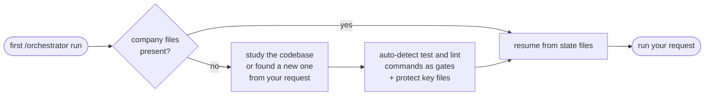

# Getting started

This guide takes you from install to your first delivered feature. It works for a brand-new project or a codebase you already have. Allow ten minutes, most of it watching the company work.

> Meeting a word for the first time - brief, gate, witness, frozen surface? The [Glossary](glossary.md) defines the company's vocabulary.

## Before you start

| You need | Used for |
|---|---|
| macOS, Linux, or Windows via WSL | The installer and hooks need a POSIX shell; native Windows is not supported yet |
| Claude Code v2.1.172+ | Nested agents (tech leads run their own teams) |
| Python 3.8+ and git | The enforcement hooks |
| Node.js with `npx` | Browser testing with screenshots (optional but recommended) |

## Step 1: install

Install the CLI once, then install the company into your project:

```bash
npm install -g claude-company
claude-company install /path/to/your/project
```

`npx claude-company install .` does the same without a global install. If you prefer no npm at all, clone the repo and run `./claude-company/install /path/to/your/project` directly - same installer either way. Add `--yes` for a non-interactive run (CI, scripts).

The installer copies the team, the rules, and the process files into your project. It merges with what you already have: your existing Claude settings, MCP servers, and `CLAUDE.md` are extended, never replaced. Run it again after an update and it refreshes claude-company's own files while leaving your state alone.

After it finishes, your project has three new things:

| Path | What it is |
|---|---|
| `.claude/` | The agent team, the commands, and the enforcement hooks |
| `company/` | The process documents, templates, and state files |
| `ORCHESTRATOR.md` | The CEO's private runbook |

## Step 2: start the company

Open your project in Claude Code and give the orchestrator your first request:

```text
/orchestrator build me a REST API for tracking workouts, with user accounts
```

You do not need to initialize anything first. The company notices it is new here and onboards itself:



You can watch this happen; it reports what it found and what it wired.

## Step 3: watch the pipeline

For a feature-sized request, expect this sequence:

1. The CEO sizes the request and dispatches the product manager.
2. The product manager explores 8 to 15 directions, then writes a spec with numbered, testable requirements. The spec records which options it considered and why the winner won.
3. The CEO turns the spec into sealed work orders and spawns a tech lead.
4. The tech lead runs its own team: developers building in parallel, then a QA engineer that clicks through the running app and captures screenshots of the loaded, empty, error, and after-action states.
5. The CEO reruns the gates itself, checks the diffs stayed inside their assignments, reads the screenshots, merges, and reports to you.

Small requests skip most of this. A typo fix gets one developer and the gates, nothing more.

## Step 4: read the delivery report

The company interrupts you for two things only:

| Interruption | What you get |
|---|---|
| Delivery | What shipped, the evidence (green gates, screenshots), what is next |
| Your decisions | Anything involving money, deploys, or business policy, batched in `company/state/DECISIONS.md` |

To check on things at any time:

```text
/standup
```

You get one screen: done, in flight, blocked, decisions you owe, and current gate status.

## When something gets blocked

Sooner or later you will see a message like this:

```text
BLOCKED: git commit requires green, fresh gates.
Fix: run `bash company/run-gates.sh` and repair any failure.
```

This is the system working. The block message contains the fix, agents get the same messages, and most blocks resolve without you. For a production emergency, tell the orchestrator it is a hotfix: hooks then log instead of block, and the process catches up afterward.

## Where to go next

- [How it works](how-it-works.md) explains the method: why briefs are sealed, why producers never grade their own work, and what the gates actually check
- [Customizing](customizing.md) covers adding gates, protecting files, and tuning process depth
