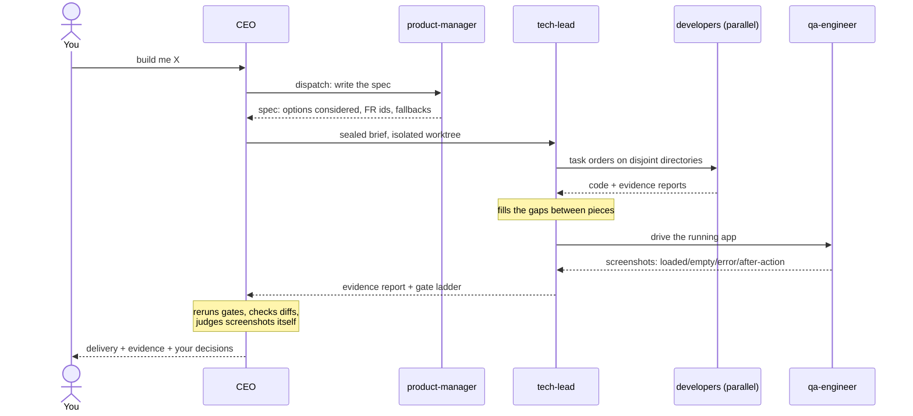
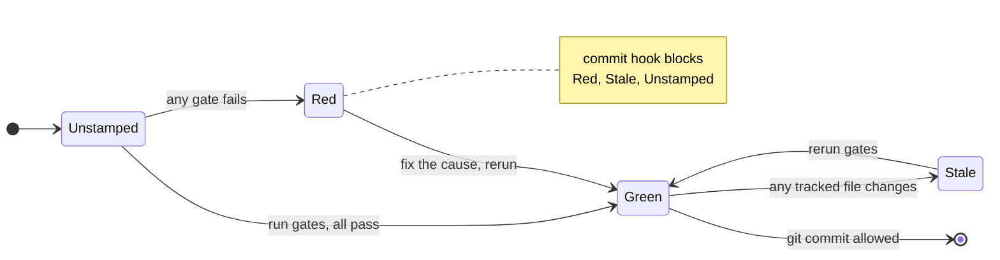
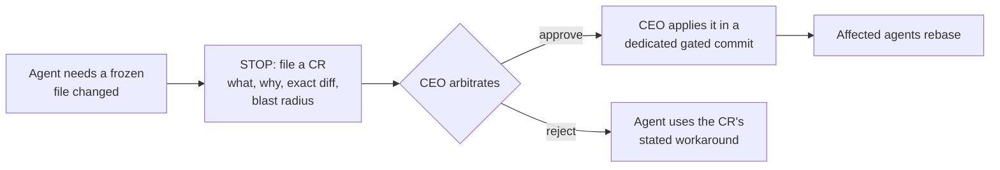

# How it works

This page explains the method behind claude-company: why it is shaped like a company, what the gates check, and how the pieces keep each other honest. Read it when you want to understand the system well enough to explain it to someone else.

<p>
  <a href="#the-core-idea">Core Idea</a> &bull;
  <a href="#the-pipeline">Pipeline</a> &bull;
  <a href="#the-paperwork">Paperwork</a> &bull;
  <a href="#the-gates">Gates</a> &bull;
  <a href="#protected-files">Protected Files</a> &bull;
  <a href="#what-the-owner-keeps">Owner</a>
</p>

## The core idea

AI agents are capable builders and unreliable narrators. Left alone, an agent under pressure will report failing work as done, widen its own scope, and edit tests until they pass. Process documents help, but an instruction is something the model can skip.

claude-company treats that as an engineering problem, not a prompting problem. The rules that matter are enforced by hooks: scripts that run before every file edit and shell command, and block the ones that break the rules. The prose explains the why; the hook supplies the no.

| Layer | What lives there | Binding? |
|---|---|---|
| Canon (`company/*.md`, `CLAUDE.md`) | The method, the conventions, the why | Advisory: agents read and follow it |
| Roles (`.claude/agents/`) | Who does what, and what each role may touch | Structural: tool access is restricted per role |
| Hooks (`.claude/hooks/`) | The rules that must hold | **Mechanical: the action is blocked** |

## The pipeline

A feature moves through separated roles, each checking the one before:



### Why a company shape

The structure copies what makes real engineering organizations work: separated roles with separated incentives.

- **Thinkers and builders are different agents.** The product manager and architect explore options and write plans. Developers build. A builder never quietly redefines the plan, because it never owns the plan.
- **Producers never grade their own work.** Each layer catches what the layer below was too close to see: developers report, leads verify, QA captures, the CEO judges, an auditor rechecks the big merges.
- **Everyone owns their own directories.** Work orders name the exact directories an agent may touch. Two agents never share one directory, so parallel work cannot collide.

The hierarchy stays shallow on purpose: the CEO, then tech leads, then their developers and QA. Deeper pyramids add token cost and lose information at every handoff.

## The paperwork

The company runs on a few typed documents rather than long conversations:

| Artifact | Written by | Read by | What it carries |
|---|---|---|---|
| Options memo | strategists + CEO | you | Numbered ideas with reasoning, scored recommendation, the strongest rejected option |
| Spec | product-manager | CEO | Requirements with stable ids (FR-01, FR-02), acceptance criteria, options considered |
| Brief | CEO | one builder | Mission, owned directories, definition of done, a decided fallback per ambiguity |
| Report | every agent | its dispatcher | Facts only: the diff, gate output, screenshots, deviations |

Two design choices matter most:

- **Builders read the brief, never the spec.** The spec is rich and human-facing; the brief is the lean slice derived from it. The builder's context stays small and its instructions stay exact.
- **Ambiguity is handled once, in writing.** Every open question gets one decided fallback, so ten parallel agents make the same assumption instead of ten different ones. Questions only a human should answer wait in `company/state/DECISIONS.md` while the build proceeds on the fallback.

## The gates

A gate is a command that must exit successfully: your test suite, your linter, your build. Gates live in `company/gates.config`, and `company/run-gates.sh` runs the ladder and stamps the result with a fingerprint of your working tree.

The stamp is what gives gates teeth:



Change one file after the gates ran and the stamp goes stale, so "it passed earlier" stops counting. Nobody, including the CEO, can commit past a red or stale stamp.

<details>
<summary><b>Two habits that keep gates meaningful</b></summary>
<br>

- **Test the negative space.** Where a table lists allowed actions, generate the complement and assert every non-listed action is rejected. Positive-only tests pass while a system silently allows everything.
- **Never trust a worktree's numbers.** Agents build in isolated git worktrees, where stale artifacts can mask integration failures. Verification reruns gates on the integrated result.

</details>

## Protected files

Some files hold the whole system up: database migrations that already shipped, the schema, lockfiles, anything with exactly one legitimate writer. These are listed in `company/frozen-surfaces.json`, and the hook blocks every edit to them.

When an agent genuinely needs a protected file changed, it files a change request (CR) instead:



The paperwork is the point: every change to a shared surface becomes visible and reviewed instead of silent.

## What the owner keeps

The escalation list is short and absolute. No agent decides:

| Decision | Why it is yours |
|---|---|
| Production deploys and migrations | Merge is integration; shipping is a button only you press |
| Anything involving money | Pricing, billing behavior, ledgers |
| Weakening a protection | The rules exist because someone will want around them |
| Scope beyond a brief | Growth is a decision, not a drift |
| Business policy | Agents run on tagged fallbacks until you answer |

One more rule catches design problems early: a gate that fails twice on the same cause stops the work and surfaces to you, because repeated failure means the plan is wrong, not the agent.

## Watching it enforce

Every hook block and every hotfix bypass appends one line to `company/state/adherence.log`:

```text
2026-07-06T14:51:57Z | guard_frozen | BLOCK  | .env       | always-frozen: .env
2026-07-06T14:51:58Z | guard_commit | BLOCK  | git commit | gates.status is stale
2026-07-06T14:52:14Z | guard_commit | BYPASS | git commit | hotfix mode
```

The log is the difference between a system that claims discipline and one that demonstrates it. Repeated blocks on the same agent or file are a signal worth reading: the work order was vague, or the design is fighting the rules.
